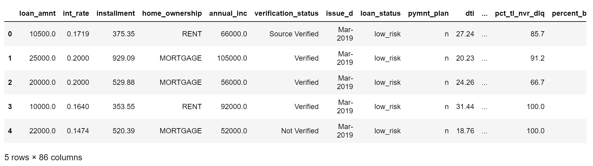
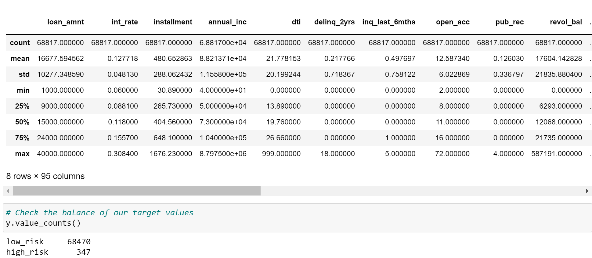
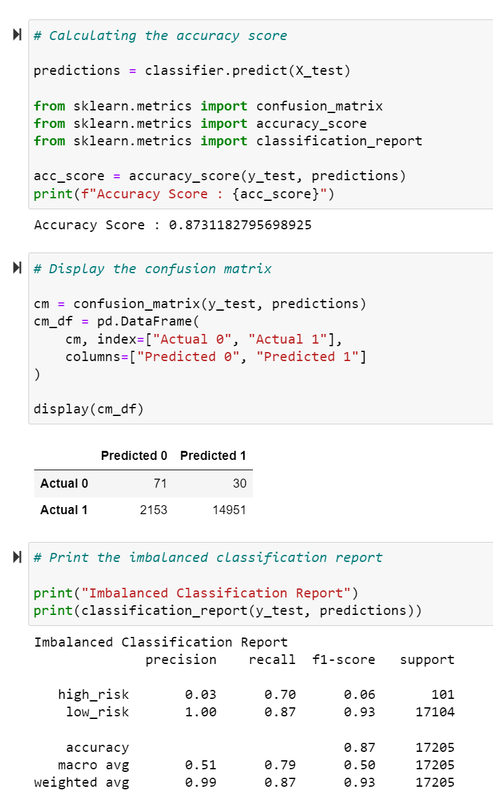

# Credit_Risk_Analysis

Applying known data, linear regressions and random forest models were constructed to predict potential credit defaults.

## Overview

By using multiple methods and models, a model is created that effectively predicts a customers credit risk, low or high.

## Results

### Cleaned Data

## Testing and Training Split

## Confusion Matrix Model

# Credit Risk Resampling

## Random Oversampling in Combination with Logistic Regression:

- Balanced Accuracy: 65.7%

- Precision: Low Risk= 99.99% High Risk= 1%

- Recall: Low Risk= 60% High Risk= 71%

## SMOTE Oversampling in Combination with Logistic Regression:

- Balanced Accuracy: 66.2%

- Precision: Low Risk= 99.99% High Risk= 1%

- Recall: Low Risk= 63% High Risk= 69%

## Undersampling in Combination with Logistic Regression:

- Balanced Accuracy: 54.4%

- Precision: Low Risk= 99.99% High Risk= 1%

- Recall: Low Risk= 40% High Risk= 69%

## Combination Sampling with Logistic Regression:

- Balanced Accuracy: 69%

- Precision: Low Risk= 99.99% High Risk= 1%

- Recall: Low Risk= 57% High Risk= 80%

# Credit Risk Ensemble

## Balanced Random Forest Classifier:

- Balanced Accuracy: 87.3%

- Precision: Low Risk= 99.99% High Risk= 3%

- Recall: Low Risk= 87% High Risk= 70%

## Easy Ensemble AdaBoost Classifier:

- Balanced Accuracy: 94.2%

- Precision: Low Risk= 99.99% High Risk= 9%

- Recall: Low Risk= 94% High Risk= 92%

# Summary

Using the Easy Ensemble AdaBoost Classifier model, the prediction of high risk customers was the best in comparison to other models. However, I recommend using the Naive Bayes model was the best to use with the given data, due to the data being imbalanced.
